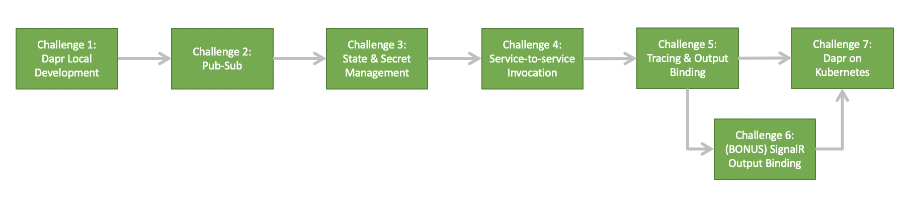

# Building Cloud Native Microservices with Dapr

## Overview & Goals

Microservices are hard. But, while being exceedingly difficult to architect they have become an increasingly popular architecture pattern. Developers are being asked to incrementally migrate from existing monolithic code bases to a microservices system. This leaves teams to spend much of their time dealing with the inherent problems of distributed applications, such as state management and service invocation.

Enter [Dapr](https://dapr.io/) - A **D**istributed **Ap**plication **R**untime built with developers in mind. Dapr helps out with some of these problems by providing consistent building blocks in the form of http/gRPC APIs that can be called natively or using one of the language SDKs.

Some Dapr lovers have created this workshop with the hopes of illustrating how microservice development can be made easier with Dapr!

\
This workshop **is**:

* A series of progressively harder challenges that allow participants to get hands-on with problems commonly faced in microservices development

* An introduction to Dapr and how it enables developers to build resilient, stateful and stateless applications

* A solution that, when completed, provides a set of industry best practices to solve distributed systems problems

* A way to get your hands dirty with event-driven architectures

\
This workshop is **not**:

* A Kubernetes workshop

* An introduction into microservices or containers

* A way to learn new programming languages

## Target Audience

This workshop is optimal for a software developer or development team who is looking to get their hands dirty with cloud native distributed applications. Ideally the audience has gotten hands-on with microservice architectures before, but knowledge of the architectural style is also sufficient.

Experience with the following is required:

* Azure
* Kubernetes applications (any distribution, AKS recommended)
* Some sort of software development

Knowledge about the following is recommended:

* .Net Core development
* Distributed systems

## Learning Objectives

Over the next two days you will use multiple Dapr components to build out and deploy a complete system of microservices that will replace CCC's core Ordering platform. The Dapr learning objectives that will be covered are as follows:

| Objective      | Description                                                                                |
|------------------|-------------------------------------------------------------------------------------------------------------|
| Dapr Local Development | Get Dapr running locally and set-up a local development environment. |
| Pub-sub | Use a Dapr pub-sub componenvt to publish orders to three different subscribers.     |
| State & Secret Management   | Use Dapr State and Secret building block APIs to store and access data. |
| Service-to-service Invocation | Implement service-to-service invocation calls between microservices. |
| Distributed Tracing | Configure and view end-to-end tracing across Dapr components. |
| Output Bindings | Construct storage and SignalR output bindings. |
| Dapr on K8s | Configure and deploy microservices application and all Dapr components onto AKS. |

## Challenge Path

The diagram below is a depiction of the workshop journey and an overview of the Dapr concepts that will be covered along the way. Challenge 6 is optional as it does not provide an introduction to any new Dapr concepts but provides additional value to the UI. Challenge 7 is a multi-part challenge as it deals with the operationalization of Dapr projects as a whole.

\

## Lets Begin!

Once you are ready, please begin by installing the [prerequisites](./prerequisites.md) and reading the [customer story](customer-story.md)...

\
 *Built with love by the Dapr Vigilantes* TM 