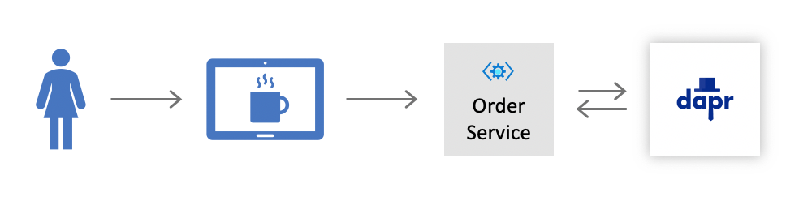
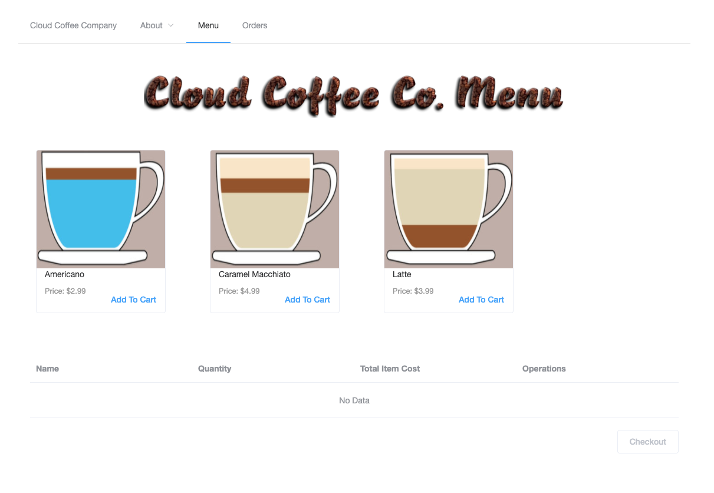

# Challenge 1: Dapr Local Development

The goals of this challenge are to become familiar with configuring and using Dapr in your local development environment and to get the source code running locally. You can choose to use either the Dapr CLI or the Dapr daemon (daprd) to run and manage local Dapr instances.

## Dapr CLI vs. daprd

The Dapr CLI ([dapr](https://github.com/dapr/cli/blob/master/docs/reference/reference.md)) allows you to install Dapr on your local dev machine or Kubernetes cluster, provides testing support, and launches and manages Dapr instances. The Dapr daemon (daprd) is installed along with the CLI and is the background process that is used to start and stop the Dapr runtime.

The primary difference is that the Dapr CLI has more functionality in terms of installation and testing whereas the Dapr daemon provides more granularity over the runtime configuration. In this workshop you can use either but we recommend using daprd for your debugging processes in order to keep the runtime up while developing your app in your local environment.

For example:

```Bash
# Run both dapr (port 3500) and your app (port 8080) side by side
dapr run --app-id my-app --app-port 8080 --port 3500 dotnet run

# Run dapr listening on port 8080 for your app and then your app separately
daprd -app-id my-app -app-port 8080 -dapr-http-port 3500
dotnet run
```

## Challenge

After ensuring all the [prerequisites](./../prerequisites.md) have been installed, clone this repository and open it up in the editor of your choice. Look through the codebase and familiarize yourself with the capabilities of the OrderService and UI projects.

You will need to build, run and test the UI and OrderService projects alongside a Dapr instance for the OrderService to see how they communicate with one another.



<br/>

### Running the Order Service

Run the Order Service along with it's Dapr sidecar using the Dapr CLI or daprd. You will have to configure the port for both the app and it's Dapr instance in order for the Dapr runtime to successfully find the app. **The Order Service should run on port 5100 and have an app-id of order-service.** 

Once dapr and the Order Service are up and running try ordering a drink through through a REST client like Postman. A payload for a sample order might look like:

```JSON
{
	"storeId": "Redmond",
	"customerName": "Harry Potter",
	"loyaltyId": "1",
	"orderItems": [
		{
			"menuItemId": 1,
			"quantity": 1
		},
		{
			"menuItemId": 2,
			"quantity": 1
		},
		{
			"menuItemId": 3,
			"quantity": 3
		}
	]
}  
```

Additional request samples for placing orders (and other useful calls) can be found in the [rest-samples folder](./../src/rest-samples). If you are using Visual Studio Code, the [REST Client extension](https://marketplace.visualstudio.com/items?itemName=humao.rest-client) can be used to send these calls. Alternatively if you're a huge curl fan try something out like the following:

```bash
curl -i -X POST -H "Content-Type: application/json" -d  "{\"storeId\": \"Redmond\",\"customerName\": \"Ronald Weasley\",\"loyaltyId\": \"1\", \"orderItems\":[{\"menuItemId\": 1,\"quantity\": 1},{\"menuItemId\": 2,\"quantity\": 2}]}" http://localhost:5100/order
```

The Development Team at Cloud Coffee Co. has also set up a [tasks.json](./../src/.vscode/tasks.json) file that you can use for local development. This is a great option for debugging with VS Code as it configures a lot of the necessary Dapr arguments for you. 

<br/>

### Running the UI

You are planning to use the Cloud Coffee Co. user interface as-is without any major code changes. Run the UI project using the following commands in your local development environment and check the result in your browser.

```bash
cd src/Vigilantes.DaprWorkshop.UI

npm install
npm run serve
```
</br>

You should be able to navigate to the Cloud Coffee Company Home page as well as the Menu Page to see what menu items you can add to your cart. Try creating and submitting an order through the UI and checking the result in your Order Service logs.



<br /> 

## Success Criteria

- Successfully run the Order Service from the command line using both the Dapr CLI and daprd.
- Post a new order to the Order Service and receive a 200 response using:
  - the UI
  - Postman or curl
  - the built-in tasks in [tasks.json](./../src/.vscode/tasks.json)

## References

- Dapr development environment [setup](https://github.com/dapr/dapr/blob/master/docs/development/setup-dapr-development-env.md)
  - Remote dev container environment [setup](https://github.com/dapr/dapr/blob/master/docs/development/setup-dapr-development-using-vscode.md)
- Dapr CLI docs [reference](https://github.com/dapr/cli#launch-dapr-and-your-app)
- Application development with Visual Studio Code [reference](https://github.com/dapr/docs/tree/master/howto/vscode-debugging-daprd)

## Next Challenge

Once you have you have completed all the success criteria, proceed to the next challenge and work on [handling the orders](challenge-2.md).
