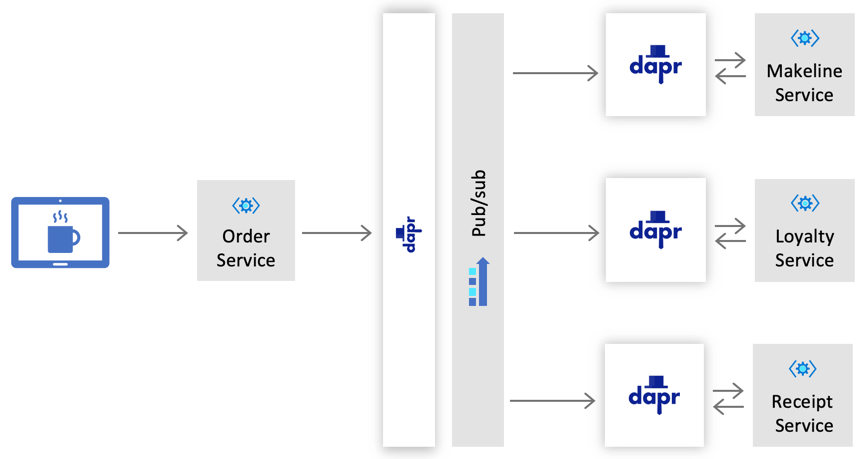

# Challenge 2: Handling Orders

Dapr enables developers to design their application with a [pub/sub pattern](https://docs.microsoft.com/en-us/azure/architecture/patterns/publisher-subscriber) using a message broker of their choice. With this approach, event consumers and producers are decoupled from one another, and communicate by sending and receiving messages that are associated with a topic.

As orders are received by the Coffee Company, the services that will handle each order independently include:

| Service     | Description                                                 | 
|-------------|-------------------------------------------------------------|
| Makeline    | Responsible for the processing and delivery of each order   | 
| Loyalty     | Manages the loyalty program for customers rewards and points| 
| Receipts    | Archives orders for auditing and historical purposes        | 

## Challenge

Using the publisher-subscriber pattern, Cloud Coffee Company will like to implement a design that is represented in the following diagram:



### Configure a Publish/Subscribe Component

Using any of the [supported message brokers](https://github.com/dapr/docs/tree/master/howto/setup-pub-sub-message-broker#reference), configure a Dapr pub/sub component for the following services listed in the table below:

| Service     | Topic Name    | Publisher or Subscriber  | App Port | Dapr HTTP Port | Dapr GRPC Port|
|-------------|---------------|--------------------------|-----------|----------|------|
| Order       | `order`       | Publisher                | 5100 | 5180      | 5101     |
| Makeline    | `order`       | Subscriber               | 5200 | 5280      | 5201     |
| Receipt     | `order`       | Subscriber               | 5300 | 5380      | 5301     |
| Loyalty    | `order`       | Subscriber                | 5400 | 5480      | 5401     |


A note about Dapr Components: You should use the components directory that is located at the [root](./../src/components/local) to store all your Dapr component files as some of them may be used across multiple services.

### Publish and Subscribe Incoming Orders

- **Publish**
  - Add code to the Order service that will [publish](https://github.com/dapr/docs/blob/master/reference/api/pubsub_api.md#publish-a-message-to-a-given-topic) a message to the `order` topic for each incoming request.
  - Incoming request to the order service example:

    ```JSON
    {
        "storeId": "Redmond",
        "customerName": "Chewy",
        "loyaltyId": "1",
        "orderItems": [
            {
                "menuItemId": 1,
                "quantity": 1
            },
            {
                "menuItemId": 2,
                "quantity": 1
            },
            {
                "menuItemId": 3,
                "quantity": 3
            }
        ]
    }  
    ```

  - Published order message example:
  
    ```JSON
    {
      "storeId": "Redmond",
      "orderId": "b85d631a-101e-005a-02f2-cee7aa06f148",
      "orderDate": "2020-02-15T11:53:00.000Z",
      "customerName": "Chewy",
      "loyaltyId": "1",
      "orderTotal": 1.25,
      "orderItems": [{
          "menuItemId": 1,
          "menuItemName": "Latte",
          "quantity": 1
      }]
    }
    ```

- **Subscribe**

  - Create an endpoint on each of the services (Makeline, Loyalty and Receipt) to support a [subscription](https://github.com/dapr/docs/tree/master/howto/consume-topic) to the `order` topic. The endpoint should have the following route: `/dapr/subscribe`.
  
  - Add the handler and necessary code to each of the subscriber services that will handle incoming messages from the `order` topic.

## Success Criteria

- Post an order to the Order service and confirm that a message is successfully published.
- Confirm that all three subscribing services are receiving a message for incoming orders.

## References

- [Dapr building blocks](https://github.com/dapr/docs/tree/master/concepts#building-blocks)
- [Dapr concepts - Publish/Subscribe Messaging](https://github.com/dapr/docs/tree/master/concepts/publish-subscribe-messaging)
- [Use Pub/Sub to consume messages from topics](https://github.com/dapr/docs/tree/master/howto/consume-topic)
- [Publish a message to a given topic](https://github.com/dapr/docs/blob/master/reference/api/pubsub_api.md)
- [Dapr Pub-Sub sample](https://github.com/dapr/samples/tree/master/4.pub-sub)
- [Dapr components](https://github.com/dapr/components-contrib/tree/master/pubsub)
- [Publisher-Subscriber pattern](https://docs.microsoft.com/en-us/azure/architecture/patterns/publisher-subscriber)
- [Create a Service Bus Namespace](https://docs.microsoft.com/en-us/azure/service-bus-messaging/service-bus-create-namespace-portal)
- [Create an Event Hub](https://docs.microsoft.com/en-us/azure/event-hubs/event-hubs-create)

## Next Challenge

Once you have you pub/sub working, proceed to the next challenge and work with the [Loyalty](challenge-3.md) service.
