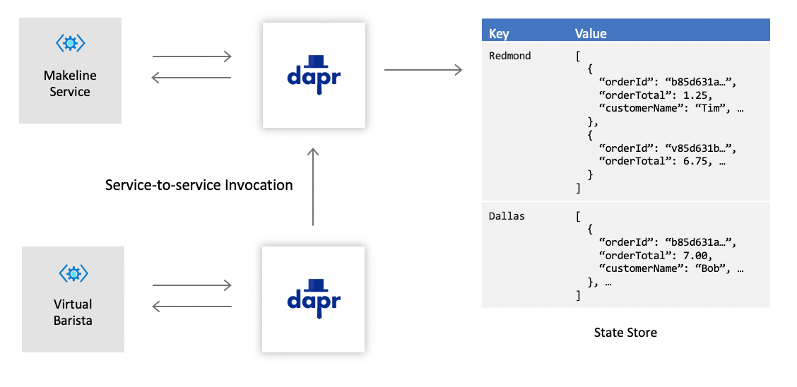

# Challenge 4: Processing Orders

Business is really picking up for the Cloud Coffee Company (CCC) and they will like to start processing orders on the new platform. Their next endeavor will be to support the fullfilment of drink orders. With your help, they will be able to meet their growing demand and ensure a positive customer experience.

In the [last challenge](challenge-3.md), you leveraged the Dapr [state](https://github.com/dapr/docs/tree/master/concepts/state-management) and [secrets](https://github.com/dapr/docs/tree/master/concepts/secrets) management components to enhance the Loyalty service. This challenge will build upon those features and also introduce a very important Dapr building block: [service invocation](https://github.com/dapr/docs/blob/master/concepts/service-invocation/README.md).

## Service Invocation

Service invocation in Dapr allows remote services to communicate with each other through a well-defined endpoint that acts as a combination of a reverse proxy with built-in service discovery, while leveraging native distributed tracing and error handling functionality.

## Challenge

With the addition of the service invocation component, as well as the previously used Dapr building blocks, CCC would like you to implement a solution that resembles the following diagram:

In the proposed architecture, the **Makeline** service is responsible for managing the state of customer orders. The **Virtual Barista** will be in charge of completing the orders. They are able to communicate with each other using Dapr and service-to-service invocation. This will ensure that any point-to-point dependencies are not created and that each service is autonomous.

### A Closer Look at Orders

Each store that CCC owns (Redmond, Dallas, Endor and elsewhere) will have it's own respective list of customer orders.

- The store ID should be used as the key.
- The value will be a collection of orders.

In the diagram, notice how the Redmond store currently has two pending orders. It will be up the implementation in the Makeline service to maintain the list of orders by adding and removing them from the list.

### Configure the State Store and Secrets Management Components

The initial configuration tasks are very similar to the previous challenge. Since the Makeline service is an indepedent microservice, it will have it's own state store and will need to be configured just like the Loyalty service to take advantage of secrets management.

- Use any of the [supported state stores](https://github.com/dapr/docs/tree/master/howto/setup-state-store) to configure a state management component for the **Makeline** service.
- Select and configure a [supported secret store](https://github.com/dapr/docs/tree/master/howto/setup-secret-store) for the **Makeline** service.
- Update the state store component to retrieve any credentials and sensitive information from the secret store.

### Support for Order Management in the Makeline Service

The state store used by the Makeline service will serve as a repository for the drink orders. As orders are received, they will be added to the store. When orders are completed, they will be removed.

Implement the following methods in the **Makeline** service:

- **Get all orders**
  - **Verb**: GET
  - **Objective**: Returns a list of all the orders in the state store.
  - **Sample route**: `/orders/{storeId}`

- **Make order**
  - **Verb**: POST
  - **Objective**: Add a new order to the state store. Remember, orders are received from the pub/sub component that was integrated in an [earlier challenge](challenge-2.md).

- **Complete order**
  - **Verb**: DELETE
  - **Objective**: Removes an order from the state store.
  - **Sample route**: `/orders/{storeId}/{orderId}`

### Service to Service Invocation

The last part of this challenge will require you to update a service called the **Virtual Barista**. This service will invoke methods in the **Makeline** service to fulfill drink orders. To complete this challenge, implement the following missing pieces in the Virtual Barista project:

- Retrieve a list of orders
  - Update the `GetOrders` function to invoke the method from the **Makeline** service that will return a list of orders.
  - Sample request: `GET http://localhost:{port}/v1.0/invoke/make-line-service/method/orders/{storeId}`

- Complete drink order
  - Update the `CompleteOrder` function to invoke the method from the **Makeline** service that will fulfill an order.
  - Sample request: `DELETE http://localhost:{port}/v1.0/invoke/make-line-service/method/orders/{storeId}/{orderId}`
  
## Success Criteria

- Demonstrate that you can retrieve and update values from the state store successfully, this includes:
  - Adding an order
  - Remove an order
  - Get all orders
- Confirm that all sensitive information, such as connection strings and keys, are not present within the state store configuration.
- Demonstrate that the **Virtual Barista** service can invoke methods in the **Makeline** service.

## References

- [Service invocation concept](https://github.com/dapr/docs/blob/master/concepts/service-invocation/README.md)
- [Service invocation API](https://github.com/dapr/docs/blob/master/reference/api/service_invocation_api.md)
- [Invoke and discover services](https://github.com/dapr/docs/tree/master/howto/invoke-and-discover-services)
- [Dapr building blocks](https://github.com/dapr/docs/tree/master/concepts#building-blocks)
- [State management](https://github.com/dapr/docs/tree/master/concepts/state-management)
- [Secrets management](https://github.com/dapr/docs/tree/master/concepts/secrets)

## Next Challenge

After you have successfully added service invocation to this challenge and have both the Makeline and Virtual Barista service working in harmony, continue with the next challenge to support [receipts](challenge-5.md).
